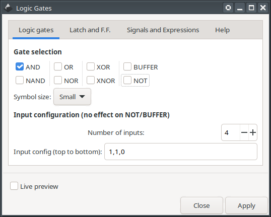

# logicGates

This extension will assist you creating latches, flip-flops and logic gates following the 'distinctive shape' of IEEE Std 91/91a-1991 standard in [Inkscape](https://inkscape.org/).


# Main features

The main features are

 - You can use up to six inputs for each gate (except NOT and BUFFER gates)
 - Each input can be set to be inverted (negated) individually
 - Latch and flip-flop generator, with customizable optional control gates and asynchronous Preset and Clear.
 - Signal labeling generator with a few pre-defined commonly used signals
 - Boolean expression editor, with optional LaTeX support and pre defined logic operator functions.

# Current and older versions

Compatibility table

|  Inkscape        |  logicGates     | inkscapeMadeEasy | Receive updates?|
|------------------|-----------------|------------------|-----------------|
|       1.0        | 1.0 (latest)    |    1.0 (latest)  | YES             |
| 0.48, 0.91, 0.92 | 0.9x (obsolete) |  0.9x (obsolete) | NO              |


**Latest version:** The latest version of **logicGates** is **1.0**. This version is compatible with Inkscape 1.0 and up only. It is **incompatible** with older Inkscape versions!

**Older versions:** If you have an older version of Inkscape, please use the files under the folder **0.9x** on Github.

**Important: Only the latest version will receive updates, new features, and bug fixes! The usage section in this documentation describes the latest version. In older versions, the disposition of the elements in the plugin's screen might be different. Some features might not be present or have different behavior.**

# Installation and requirements

Installation procedures for latest and older versions are described below.

## Requirements (all versions)

- You will need [inkscapeMadeEasy](https://github.com/fsmMLK/inkscapeMadeEasy) plugin installed. Check the compatibility table above to know the version you need.

## Installation procedure (v1.0 only)

**logicGates** was developed using Inkscape 1.0 in Linux (Kubuntu 18.04). It should work in different OSs too as long as all requirements are met.

1. Install [inkscapeMadeEasy](https://github.com/fsmMLK/inkscapeMadeEasy), **version 1.0** (latest). Follow the instructions in the manual page. **Note:** LaTeX text is used in **logicGates** if the support is activated (nicer results), otherwise regular text elements will be used.

2. **logicGates** installation

    1. Go to Inkscape's extension directory with a file browser. Your inkscape extension directory can be accessed by opening Inkscape and selecting ``Edit > Preferences > System``. Look for the item **User Extensions**  field. There is a button on the right of the field  that will open a file explorer window in that specific folder.

    2. Create a subfolder in the extension directory with the name ``logicGates``. **Important:**  Be careful with upper and lower case letters. You must write as presented above.

    3. Download **logicGates** files and place them inside the directory you just created.

       You don't have to copy all files from Github. The files you will need are `logicGates.py` and `logicGates.inx`. **You can find these files inside the ``latest`` folder**. In the end you must have the following files and directories in your Inkscape extension directory.

       **LaTeX users:** the 
       
        ```
           inkscape
            ┣━━extensions
            ┋   ┣━━ inkscapeMadeEasy      <-- inkscapeMadeEasy folder
                ┃    ┣━━ inkscapeMadeEasy_Base.py
                ┃    ┣━━ inkscapeMadeEasy_Draw.py
                ┃    ┣━━ inkscapeMadeEasy_Plot.py
                ┃    ┗━━ basicLatexPackages.tex
                ┃
                ┣━━ textext               <-- texText folder (if you installed textText)
                ┃    ┋
                ┃
                ┣━━ logicGates            <-- logicGates folder
                ┋    ┣━━ CircuitSymbolsLatexPreamble.tex
                     ┣━━ logicGates.py
                     ┗━━ logicGates.inx
        
        NOTE: You might have other sub folders inside the extensions directory. They don't interfere with the plugin.
        ```

## Installation procedure (v0.9x only)

**logicGates** was developed using Inkscape 0.48 and 0.91 in Linux (Kubuntu 18.04). It should work in different OSs too as long as all requirements are met.

1. Install [inkscapeMadeEasy](https://github.com/fsmMLK/inkscapeMadeEasy), **version 1.0** (latest). Follow the instructions in the manual page. **Note:** LaTeX text is used in **logicGates** if the support is activated (nicer results), otherwise regular text elements will be used.

2. **logicGates** installation

    1. Go to Inkscape's extension directory with a file browser.

    2. Download **logicGates** files and place them inside the directory you just created.

       You don't have to copy all files from Github. The files you will need are `logicGates.py` and `logicGates.inx`. **You can find these files inside the ``0.9x`` folder**. In the end you must have the following files and directories in your Inkscape extension directory.

        ```
        inkscape
            ┣━━extensions
            ┋   ┣━━ inkscapeMadeEasy_Base.py
                ┣━━ inkscapeMadeEasy_Draw.py
                ┣━━ inkscapeMadeEasy_Plot.py
                ┣━━ textextLib
                ┃   ┣━━ __init__.py
                ┃   ┣━━ basicLatexPackages.tex
                ┃   ┣━━ textext.inx
                ┃   ┣━━ textext.py
                ┃
                ┣━━ logicGates.py            <-- from repository folder 0.9x!
                ┣━━ logicGates.inx           <-- from repository folder 0.9x!
                ┋
        ```

# Usage

The extension can be found under `extensions > fsmMLK > Circuit symbols` menu.

This extension is presented in three tabs. The **Logic gates** and **Latch and F.F.** tabs  allow you to create logic gates and latches/flip-flops respectively, while **Signals and Expressions** create boolean expressions and logic signal labels.

## Logic Gates tab



**Gate checkboxes:** You can select the gates. More than one gate can be created at once, however they will share the same input configuration (see below).


**Number of inputs:** Number of inputs of the gate. This parameter does not affect NOT and BUFFER gates. You can choose any number between 2 and 6.

**Input config:** You can select whether the inputs must be inverted. This field accepts a sequence of values `1` or `0`. You can create a sequence of 1s and 0s without any spaces, with spaces or commas.
 
  - 1 stands for regular input
  - 0 stands for inverted input


The first element of the sequence is associated to the input at the top. If this string has less elements than the number of inputs, the remaining inputs will be set to regular inputs.

Examples:

 


## Latch and F.F. tab


**Type:** You can select the type of Latch/Flip-flop.


**Symbol size:** You can select between 3 sizes, presented below.


**Suppress Q and not{Q} outputs:** You can choose any output (Q and NOT{Q}) to be suppressed.


**Control Gate type:** You can optionally include a control gate, by level (latch) or edge (flip-flop). Se image below.

**Control Gate Activation Logic:** Here you can select the type of activation logic of the control gate. Se image below.

   - active on HIGH (latch) or rising edge ⮥ (flip-flop)
   - active on LOW (latch) or falling edge ⮧ (flip-flop) 


**Asynchronous Preset:** Add asynchronous Preset signal. You can select between active HIGH or LOW.

**Asynchronous Clear:** Add asynchronous Clear signal. You can select between active HIGH or LOW.

 

## Signals and Expressions tab


This tab is presented in two subtabs, *Signals* and *Expressions*. The first create signal nodes to add to your logic circuit. The second creates a text element with a boolean expression. The 'Apply' button will execute the action associated to the subtab that is on the top

#### Signals subtab


**Signal type:** Allows the selection of one type of signal. You can select a few commonly used signals or select ``Custom`` to customize its label. (see below)

  

**Direction:** Direction of the signal line. This option is used only if ``Draw signal line`` option is enabled.


**Custom label:** Label of the signal. This option is used only if ``Custom`` is selected in `Signal type`. If LaTeX support is enabled the text will be inserted in a mathematical environment $...$


**Draw signal line:** signal line toggle.


#### Expressions subtab

  

**Boolean expression:** Boolean expression area. Predefined commands were created for the basic boolean operators:


> Note: The command ``\NOT`` has one argument and **MUST** be enclosed between ``{ }``

Examples:


# Observations

 - The objects will be created at the center of your screen.

# Examples


